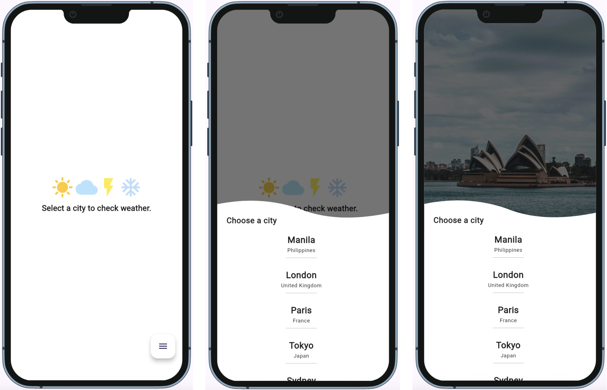
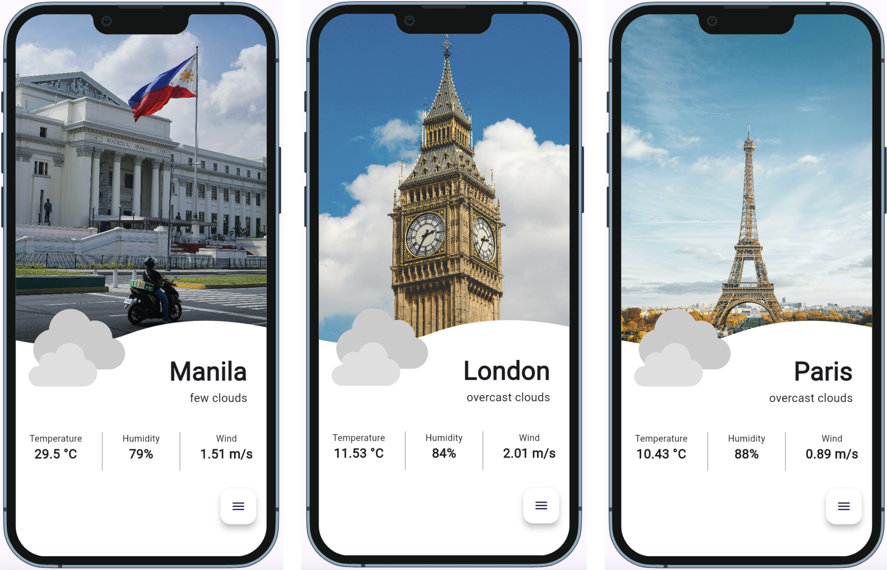
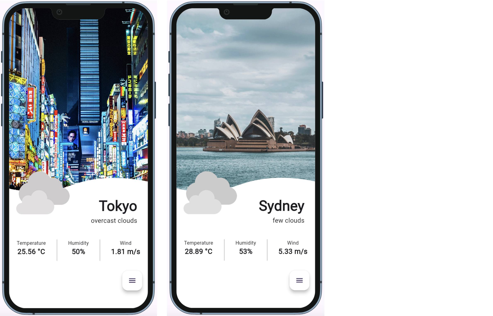

Go to https://openweathermap.org/ and create an account
then go to this link https://home.openweathermap.org/api_keys 
and copy the api key.

Run this app with this command:
flutter run --dart-define=API_KEY=your_secret_key

# App Screenshots

Here are some preview screenshots of the app:

## Homepage and bottom modal

## Cities

